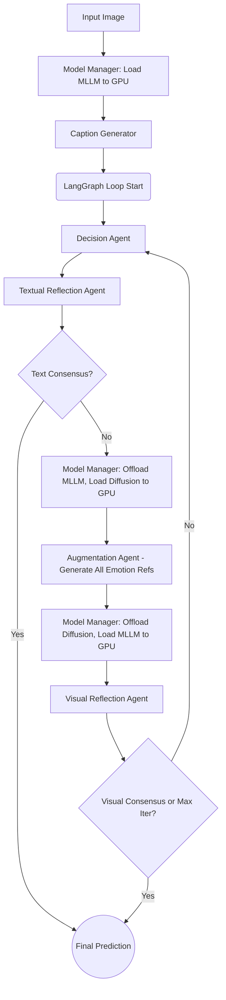

# High-Level Design (HLD): Compute-Efficient MERMAID Framework

## 1. Introduction
This document outlines the High-Level Design for a compute-efficient implementation of the MERMAID (Multi-perspective Emotion Recognition via Multi-Agent generative Decision-making) framework. The system is designed to run on constrained hardware (16GB System RAM, 12GB GPU VRAM - RTX 3050).

## 2. System Architecture
The system follows a cyclic, multi-agent architecture orchestrated by a state graph (LangGraph). The workflow is divided into discrete phases where multimodal large language models (MLLMs) and text-to-image diffusion models collaborate to refine an emotion prediction.

### 2.1 Core Components
1.  **State Manager (LangGraph Orchestrator):** Manages the shared state (image, caption, current prediction, candidate emotions, feedback) and controls the transition between agents based on conditional edges (consensus vs. revision).
2.  **Model Manager (Memory Orchestrator):** A critical hardware-level component responsible for sequentially offloading models between CPU RAM and GPU VRAM using `accelerate` to prevent Out-Of-Memory (OOM) errors.
3.  **Caption Generator (MLLM):** Generates a rich textual description of the input image before the main loop begins.
4.  **Decision Agent (MLLM):** Acts as the primary classifier, taking the image and textual/visual feedback to propose an emotion label.
5.  A text-only critic that evaluates the logical consistency between the generated caption and the Decision Agent's prediction.
6.  **Augmentation Agent (Diffusion Model):** Generates a set of reference images depicting all candidate emotions applied to the original scene, accelerated with ByteDance Hyper-SD's 4-step LoRA on a Stable Diffusion 1.5 Img2Img pipeline.
7.  **Visual Self-Reflection Agent (MLLM):** Compares the original image against the generated reference images to provide visual feedback on the prediction.

## 3. Workflow Data Flow

## 4. Hardware Constraints & Mitigation Strategies
*   **Target Hardware:** Intel i7, 16GB/32GB RAM, NVIDIA RTX 3050 (12GB VRAM).
*   **Model Quantization:** MLLMs (e.g., Qwen2-VL-2B or 7B) will be quantized to 4-bit/8-bit using `bitsandbytes` to fit within the 12GB VRAM limit.
*   **Sequential Execution:** The MLLM and the Diffusion model will *never* reside in VRAM simultaneously. The Model Manager handles dynamic loading/unloading.
*   **Hyper-SD Acceleration:** The Augmentation Agent fuses ByteDance's Hyper-SD 4-step LoRA into the Stable Diffusion 1.5 Img2Img pipeline and uses the DDIM scheduler to reduce inference to 4 steps while retaining image structure.
*   **Structured Outputs:** `instructor` or `outlines` libraries are used to enforce strict JSON outputs from the MLLMs, ensuring robust state transitions without parsing errors.

## 5. Technology Stack
*   **Orchestration:** `langgraph`, `langchain-core`
*   **Machine Learning:** `torch`, `transformers`, `diffusers`, `peft` (for LoRA support)
*   **Optimization:** `accelerate` (memory management), `bitsandbytes` (quantization)
*   **Structured Generation:** `instructor` / `outlines`
 **Textual Self-Reflection Agent (MLLM):**