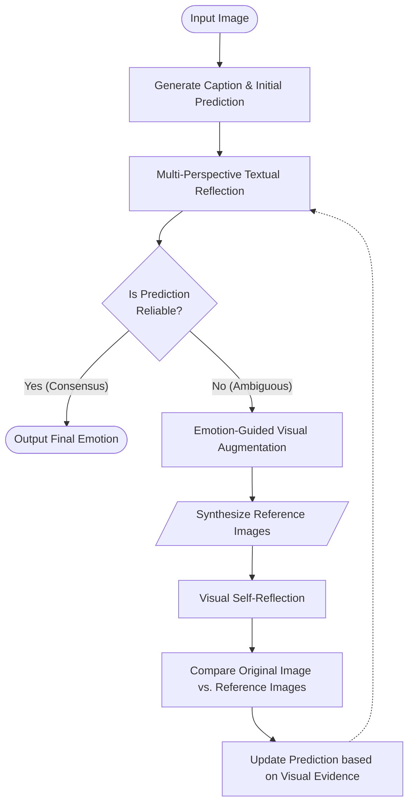
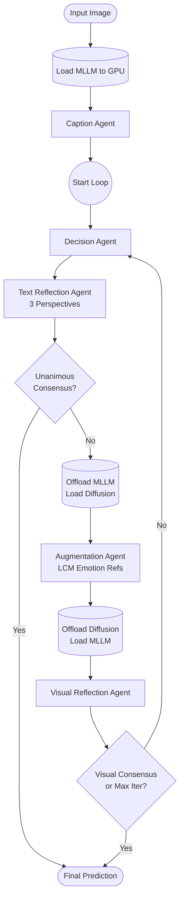

# 🧜‍♀️ MERMAID: Compute-Efficient Affective Emotion Recognition

Welcome to our optimized, compute-efficient implementation of the **MERMAID** (Multi-perspective Emotion Recognition via Multi-Agent generative Decision-making) framework. 

This repository translates state-of-the-art affective image recognition research into architecture designed specifically to run entirely on consumer hardware (a single 12GB VRAM GPU).

---

## 🎯 Project Overview
Emotion recognition in images is inherently subjective. Standard Vision-Language Models (VLMs) often misinterpret subtle cues or hallucinate context because they process an image only once. 

MERMAID solves this by wrapping the VLM in a **Multi-Agent System** that mimics human critical thinking. It utilizes distinct agent perspectives (Text Reflection) to critique initial guesses, and relies on generative diffusion models (Visual Augmentation) to create "alternate emotional realities" to compare against the original image.

---

## 🏗️ Architectural Decisions: The "Why" and "How"

Implementing enterprise-grade research on consumer hardware required several critical engineering pivots.

### 1. Hardware Constraints & Memory Orchestration (12GB VRAM Limit)
**The Problem:** Running a 7B parameter Multimodal LLM (e.g. LLava-Next) alongside a Stable Diffusion pipeline concurrently results in instant Out-Of-Memory (OOM) failures on a 12GB GPU.
**The Solution:** We built a custom `MemoryOrchestrator` (`core/memory_manager.py`). The orchestrator dynamically hot-swaps the models. The MLLM is quantized to **4-bit (NF4)** using `bitsandbytes`, compressing it from 15GB to ~5GB. The orchestrator aggressively flushes KV caches (`torch.cuda.empty_cache()`) and garbage-collects tensors whenever the graph transitions between MLLM inference and Diffusion generation.

### 2. Resolution Capping for Dynamic VLMs
**The Problem:** The **Emotion6** dataset contains high-resolution internet images. MLLM uses dynamic resolution and scales its token sequence to match the image size. High-res images generated tens of thousands of tokens, instantly fragmenting the VRAM and triggering OOM cascades.
**The Solution:** We strictly aligned with the paper's preprocessing methodology by capping the image resolution to 256x256 pixels (`max_pixels = 65536`) inside `caption_agent.py` and `visual_reflection.py`. This mathematically guarantees the KV cache stays within bounds.

### 3. Accelerating the Augmentation Loop (LCM Integration)
**The Problem:** The original authors utilized InstructPix2Pix requiring 100 denoising steps per emotion. In a multi-agent loop generating 6-8 images, this equates to 600-800 steps per image evaluated—rendering the process impractically slow.
**The Solution:** We integrated a **Latent Consistency Model (LCM) LoRA** into the Diffusion pipeline. By switching to `LCMScheduler`, we achieve equivalent visual edits in just **4 denoising steps**, accelerating the entire Visual Augmentation agent by over 20x.

### 4. Simulating Proprietary Emotion Embeddings
**The Problem:** The paper injects emotion embeddings directly into InstructPix2Pix using a proprietary, custom-trained Q-Former ("Emotion Adapter"). Because these weights are not available for standard Hugging Face pipelines, we could not replicate this exactly.
**The Solution:** We engineered a textual workaround, translating the latent injection into explicit English instructions (e.g., `prompt = f"alter the image to express a strong feeling of {emotion}"`), allowing us to use standard open-source pipelines.

---

## 🔄 System Architecture & Data Flow

The entire workflow is orchestrated via **LangGraph**, routing a shared `MERMAIDState` dictionary through various intelligent nodes.

### Conceptual Algorithm Flow (As per the Research Paper)
This diagram illustrates the generalized theoretical approach proposed by the MERMAID framework:

### Technical Implementation Data Flow (Our Codebase)
This diagram illustrates how we actually engineered the system to run on consumer hardware using dynamic model swapping:

### 📂 Repository File Structure
* **`main.py`**: The central entry point. Constructs the LangGraph, initializes datasets (EmoSet, Emotion6), wraps execution in aggressive memory cleanup loops, and writes results to CSV.
* **`core/state.py`**: Defines the `MERMAIDState` `TypedDict` schema governing all data passed between nodes.
* **`core/memory_manager.py`**: Houses the `MemoryOrchestrator` responsible for initializing models in 4-bit, hot-swapping between CPU and GPU, and managing VRAM limits.
* **`agents/caption_agent.py`**: Initial MLLM node that grounds the image into text.
* **`agents/decision_agent.py`**: Evaluates the image, caption, and aggregated feedback to predict the dominant emotion.
* **`agents/text_reflection.py`**: Spawns multiple distinct textual perspectives (e.g., *Focus on Scene*, *Focus on Color*) to critique the prediction. Enforces the Unanimous Voting threshold.
* **`agents/augmentation.py`**: Uses LCM-accelerated InstructPix2Pix to synthesize emotional "alternate reality" references.
* **`agents/visual_reflection.py`**: Feeds the original image + all augmented reference images description simultaneously into MLLM to confirm or revise the prediction based on visual evidence.
* **`dataloader/`**: Contains modular loading scripts (`emoset.py`, `emotion6.py`) ensuring uniform sampling limits across datasets.

---

## 📊 Evaluation Results

We benchmarked our implementation across multiple hardware configurations, datasets, and models against the baseline established by the paper. 

*(Note: The paper utilizes proprietary 13B models and H100 clusters, while our results represent optimized 7B performance on consumer 12GB GPUs).*

| Dataset | Architecture (MLLM + Diffusion) | Total Samples | Accuracy (Ours) | Accuracy (Paper Denoising 100 Steps) | Comparison | Correct | Incorrect |
| :--- | :--- | :--- | :--- | :--- | :--- | :--- | :--- |
| **Emotion6** | LLaVA-NeXT 7B + LCM LoRA | 1,000 | **46.30%** | **61.90%** | ▼ 15.60% | 463 | 537 |
| **EmoSet** | LLaVA-NeXT 7B + LCM LoRA | 1,000 | **52.40%** | **50.40%** | ▲ 2.00% | 524 | 476 |
| **ArtPhoto** | LLaVA-NeXT 7B + LCM LoRA | 806 | **35.61%** | **34.72%** | ▲ 0.89% | 287 | 519 |
| **Emotion6** | **Qwen2.5-VL 7B** + LCM LoRA | 1,000 | **51.90%** | **56.80%**\* | ▼ 4.90% | 519 | 481 |
| **EmoSet** | **Qwen2.5-VL 7B** + LCM LoRA | 1,000 | **59.10%** | **63.70%**\* | ▼ 4.60% | 591 | 409 |

*The migration to Qwen2.5-VL + Interleaved Multi-Image Prompting yielded a significant accuracy jump over LLaVA-NeXT across all benchmarks.*
*\* Note: Paper results for Qwen use Qwen2-VL 7B, while our implementation uses the newer Qwen2.5-VL 7B.*

---

## 👥 Contributors

* **Umesh Vishwakarma** – Directed data aggregation and organization. Developed the robust data loader scripts and engineered the core system infrastructure.
* **Pulak Kumar Sarkar** – Architected the visual augmentation agents, integrating the generative pipeline and implementing the emotion-guided visualization processes.
* **Madan Vishwakarma** – High Level and Low Level representation of the strategy in the paper, translating theoretical concepts from the paper into a functional implementation. Led the continuous evaluation and benchmarking across multiple datasets.
